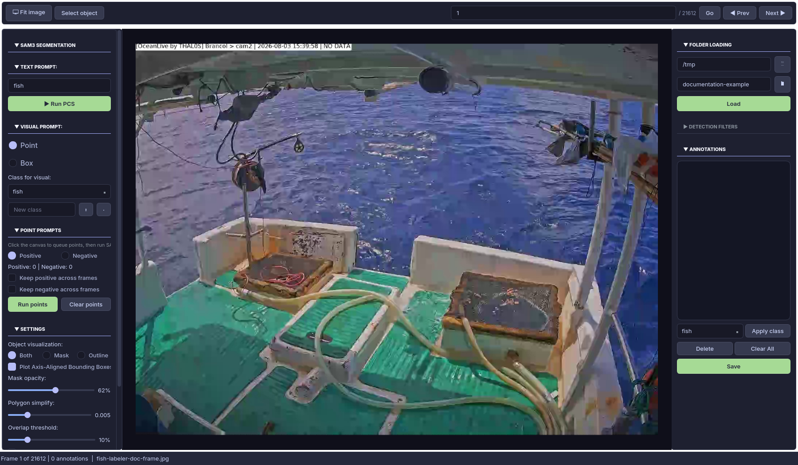
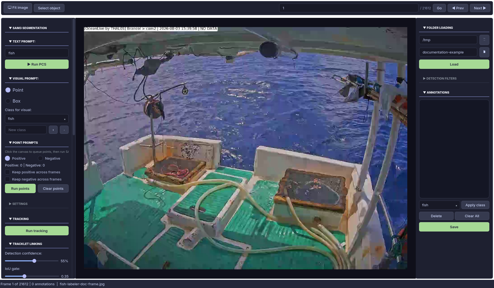

# Fish Labeler User Guide

Fish Labeler turns a fishing-vessel video into sampled image frames, initial SAM 3 segmentation labels, and a reviewable YOLO segmentation dataset. The normal workflow is:

1. Process a video into a named run.
2. Open that run in the Qt application.
3. Review, correct, filter, and track annotations frame by frame.
4. Save the curated dataset and inspect its export files.

Each run lives below `output/<run-name>/`, so the source video can live anywhere on the machine.

## Before You Start

Install the project dependencies and put the approved SAM 3 weights at `src/models/sam3.pt`. The model is available from [facebook/sam3 on Hugging Face](https://huggingface.co/facebook/sam3).

```bash
uv sync --locked --all-extras --dev
uv run fish-labeler --help
```

For practical video processing, use a GPU supported by the installed PyTorch build. You can launch the Qt app separately to review an existing run.

## 1. Process a Video

Run the `video` workflow for each source video or logical batch. It samples frames, runs text-prompt segmentation, and creates a self-contained dataset directory.

```bash
uv run fish-labeler video \
  --video /data/vessel-trip-01.mp4 \
  --output-dir vessel-trip-01 \
  --classes fish tuna shark \
  --frame-step 12
```

This creates `output/vessel-trip-01/`. The example processes every 12th source frame, rather than every frame.

### Choose Sampling Deliberately

Sampling controls review effort and how much motion is represented in the dataset.

| Option | Use it for | Default |
|---|---|---|
| `--frame-step N` | Process every $N$th video frame. Use a smaller value for fast movement or short events. | `6` |
| `--sample-every-seconds S` | Sample at a stable time interval. This overrides `--frame-step`. | none |
| `--max-frames N` | Make a small trial run before processing the full video. | none |
| `--overwrite-frames` | Re-extract frame images that already exist in the run. | off |

Start with `--max-frames 20` when testing new prompts or confidence settings. Inspect the result in the app before committing to a long run.

### Tune the Initial Detection Pass

| Option | What it changes |
|---|---|
| `--classes fish,tuna shark` | Text prompts given to SAM. Comma-separated and space-separated values can be mixed. |
| `--conf 0.5` | Minimum model confidence for initial detections. Raise it to reduce weak detections; lower it to keep more candidates for review. |
| `--iou 0.5` | Non-maximum-suppression overlap threshold used by the initial pass. |
| `--imgsz 728` | Inference image size. Larger values can preserve small details but use more memory and time. |
| `--device cuda:0` | Select a specific inference device. Omit it to use the predictor default. |
| `--quantize 16` | Use FP16 or FP32 inference precision. CPU processing uses FP32. |

The video workflow reports progress in the terminal. Do not move or rename files inside the run while it is active.

## 2. Open a Run in the App

Launch the Qt application with the sampled image directory and matching run name:

```bash
uv run fish-labeler app \
  --images output/vessel-trip-01/images \
  --output vessel-trip-01
```

You can also run `uv run fish-labeler app`, enter the paths in **Folder Loading**, and select **Load**.

The **Image folder** must point to the run's `images/` directory. The **Output folder** is the run name, not an arbitrary absolute export path: entering `vessel-trip-01` maps to `output/vessel-trip-01/`.



### Read the Workspace

| Area | What it shows and does |
|---|---|
| Top bar | Fits the image, enters selection mode, jumps to a frame number, and moves to the previous or next sampled frame. |
| Left panel | Creates or refines segmentations with text, points, boxes, display settings, and tracking. It scrolls independently. |
| Canvas | Shows the current sampled image, annotation outlines or masks, the hovered item, and selected annotations. |
| Right panel | Loads a run, filters detections, lists annotations visible in the current frame, changes classes, deletes, and saves. |
| Status bar | Shows the current frame number, annotation count, and image filename. |

Frame numbers in the top bar are positions in the loaded sampled-image sequence. They are not necessarily the original video frame numbers when sampling was used.

## 3. Review Annotations

The initial labels from the video workflow are candidates, not final truth. Review each sampled frame at a useful zoom, correct classes and boundaries, then move forward. Navigation saves the current frame automatically.

### Navigate the Image

| Action | Result |
|---|---|
| Mouse wheel over the canvas | Zoom toward or away from the pointer. |
| Right-drag, middle-drag, or Space + left-drag | Pan the image. |
| Double-click, `F`, or **Fit image** | Fit the current image to the canvas. |
| `Left` / `Right` or **Prev** / **Next** | Save the current frame and navigate. |
| Frame number + **Go** | Jump directly to a sampled-frame position. |

### Filter Before Reviewing

Open **Detection Filters** in the right panel to set a per-class confidence threshold. Detections below the threshold are hidden from the canvas and annotation list. This is useful for focusing review on high-confidence candidates or exposing uncertain predictions one class at a time.

Filters change visibility, not the stored label immediately. However, **Save** and automatic saves write only currently visible annotations. Before final export, ensure the active thresholds show every label you intend to retain. Manually created labels do not carry an inference confidence and remain visible.

### Select, Correct, and Delete

1. Select **Select object** or press `3`.
2. Click an annotation to select it. Use `Ctrl` or `Shift` for a multi-selection, or drag an empty area to box-select.
3. Select a replacement class in the right-panel dropdown and choose **Apply class**.
4. Choose **Delete** or press `Delete` to remove selected annotations. Use **Clear All** only when the whole frame should be empty.
5. Choose **Save** or press `Ctrl+S` when you want an explicit checkpoint.

The annotation list uses the same color coding as the canvas. Selecting an item in either location updates the other, which helps in crowded frames.

## 4. Create or Refine Segmentations

Use the left panel when an initial label is missing, has a poor boundary, or needs a more precise prompt.

### Text Prompt

Enter one or more visual concepts, separated by commas, in **Text prompt**, then select **Run PCS**. For example, `fish, tuna` asks SAM to find instances of each concept in the current frame. New prompt names are added to the available class list.

Text prompt is best for finding several objects in one frame. Review the result before moving on, especially where equipment, water glare, or overlapping catch resembles the target class.

### Point Prompt

Choose **Point** and the target class, then click the canvas to queue points.

| Point type | Meaning |
|---|---|
| Positive | Marks a region that belongs to the requested object. |
| Negative | Marks a nearby region that must be excluded. |

Select **Run points** to create the segmentation. Use positive points inside the object and negative points on confusing background or a neighboring object. **Clear points** removes the queued prompts. The two “Keep ... across frames” options reuse point coordinates after navigation; use them only when camera framing and object position are stable.

### Box Prompt

Choose **Box**, choose a class, and drag a rectangle around one object. This is usually the most reliable prompt for a partially occluded object or when two instances are close together.

### Class Management

The **Class for visual** dropdown controls the class assigned by point and box prompts. Type a class name in **New class** and use `+` to add it. The `-` button removes the current class only when it is not in use. The saved `classes.txt` determines class-id order in YOLO labels, so avoid renaming or reordering classes midway through a dataset unless downstream consumers are updated too.

### Display and Segmentation Settings

| Control | Use |
|---|---|
| Both / Mask / Outline | Choose how annotations are rendered while reviewing. This does not alter export data. |
| Plot Axis-Aligned Bounding Boxes | Show rectangular boxes instead of oriented quadrilaterals for visual inspection. |
| Mask opacity | Make masks more or less transparent over the image. |
| Polygon simplify | Lower values preserve more boundary detail; higher values produce simpler polygons. |
| Overlap threshold | Reject a new mask when too much of it overlaps an existing annotation. |
| Fallback to box if SAM fails | Retain a box annotation when segmentation cannot return a usable mask. |
| YOLO-Seg / PNG Mask | Choose the output formats written during save. |

Sliders change only through direct pointer interaction. Mouse-wheel movement and keyboard/keypad input do not change a slider value, so canvas navigation does not accidentally alter a review setting.

## 5. Track Objects Across Frames

Open **Tracking** in the left panel after initial detection settings are reasonable.



### Run Automatic Tracking

1. Open **Tracking** and adjust **Tracklet Linking** settings if needed.
2. Select **Run tracking**.
3. Review generated tracks in **Track Manager**.
4. Save after manual track changes.

Tracking assigns an identity to detections across the loaded sequence. It does not replace a segmentation label; it adds track information in `tracks.json` so consecutive detections can be reviewed as an object history.

| Group | Purpose |
|---|---|
| Tracklet Linking | Sets the detection-confidence cutoff, overlap and position gates, missed-frame limit, and motion/shape constraints used to join nearby detections. |
| Offline Stitching | Joins compatible tracklets across longer gaps. Use this for temporary occlusion or missed detections. |
| Track Manager | Select tracks, apply a known track ID to selected annotations, merge tracks, delete a track, or clear assignments. |

Start with defaults. Tighten distance, size, or aspect gates when identities jump between similarly sized objects; relax missed-frame or stitching-gap limits when objects disappear briefly.

## 6. Understand the Saved Data

A processed and reviewed run has this layout:

```text
output/<run-name>/
├── images/                 sampled source frames used by the app
├── labels/                 YOLO segmentation text files
├── annotations_json/       per-frame detections, confidence, polygons, and track ids
├── classes.txt             class names in YOLO class-id order
├── data.yaml               YOLO dataset configuration
├── metadata.json           video and aggregate detection metadata
├── run_config.json         video-processing settings and totals
└── tracks.json             track assignments and tracking configuration
```

### Files Used by the App

| File or directory | How to read it |
|---|---|
| `images/` | Opened as the app's image folder. Image names connect a frame to its labels. |
| `labels/<image-stem>.txt` | Loaded as YOLO polygons. Each line is `class_id x1 y1 x2 y2 ...`, with coordinates normalized to $[0, 1]$. |
| `classes.txt` | Line number is the `class_id` used in labels. The first line is class `0`. |
| `tracks.json` | Stores per-frame track IDs, track summaries, and the tracking settings used. |

### Files for Analysis or Reproducibility

| File | Contents |
|---|---|
| `annotations_json/<frame>.json` | Original per-frame detections, boxes, confidence, mask polygons, and track IDs. Useful for analysis pipelines. |
| `data.yaml` | Dataset path plus class-id-to-name mapping for YOLO tooling. |
| `metadata.json` | Source-video properties, sampling summary, class counts, and confidence statistics. |
| `run_config.json` | The effective model, prompts, sampling interval, threshold, image size, device, and output totals. |
| `masks/<image-stem>.png` | Created only when **PNG Mask** is selected during review saves. Pixel values identify annotation instances; `0` is background. |

The app copies a source image into `images/` the first time it saves annotations for that frame. A frame with no visible labels has its corresponding annotation artifacts removed when saved.

## Common Workflows

### Build a New Dataset

1. Run `fish-labeler video` with a conservative sample interval and target classes.
2. Open `output/<run-name>/images` with the same output name in the app.
3. Expand detection filters and initially show all classes and confidence levels.
4. Correct false positives, missed objects, classes, and poor masks.
5. Use point or box prompts for difficult objects.
6. Run tracking when identity continuity matters.
7. Confirm all intended labels are visible, save, and use `labels/`, `classes.txt`, and `data.yaml` in downstream YOLO tooling.

### Resume a Review Session

1. Launch the app with the same `--images` directory and `--output` name.
2. Select **Load** when opening without command-line paths.
3. The app restores saved labels and its last progress position for that image folder.
4. Continue with **Next** or the right arrow key.

### Revisit Only Uncertain Detections

1. Open **Detection Filters**.
2. Raise thresholds for classes that are already clean, or lower a class threshold to expose uncertain detections.
3. Review relevant frames and correct labels.
4. Restore a threshold that makes all desired labels visible before saving the final dataset.

## Keyboard Shortcuts

| Key | Action |
|---|---|
| `Left` / `Right` | Previous / next image, saving the current frame. |
| `1` / `2` / `3` | Point prompt / box prompt / select mode. |
| `Delete` | Delete selected annotations. |
| `Ctrl+S` | Save visible annotations for the current frame. |
| `Ctrl+A` | Select all annotations. |
| `Esc` | Deselect annotations. |
| `F` | Fit the image to the canvas. |
| `R` | Run the current text prompt. |
| `Enter` in the text prompt | Run text-prompt segmentation. |
| `Enter` in the frame field | Jump to that frame position. |

## Troubleshooting

| Symptom | What to check |
|---|---|
| The app opens with no frames | Confirm **Image folder** points to `output/<run-name>/images`, not the run root or source video. |
| Labels do not appear | Confirm the output name matches the run, inspect `classes.txt`, and lower the matching class's detection-filter threshold. |
| A label disappeared after saving | A filter may have hidden it. Set thresholds so all intended labels are visible before saving. |
| A visual prompt does not segment an object | Use a box prompt, add positive and negative points, or enable **Fallback to box if SAM fails**. |
| Tracking merges separate objects | Tighten center, IoU, size, or aspect gates, then rerun tracking and review affected tracks. |
| Processing is too slow | Increase `--frame-step`, lower `--imgsz`, test with `--max-frames`, or use a supported GPU. |
| The model cannot be found | Put `sam3.pt` in `src/models/` or pass `--model /path/to/sam3.pt`. |